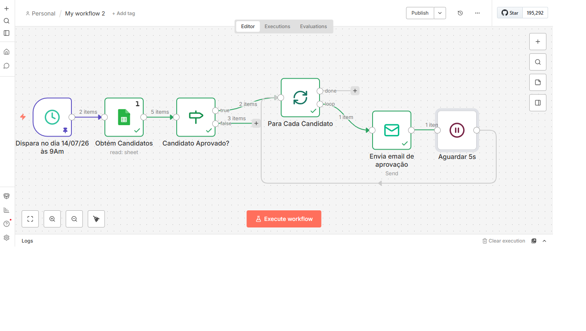
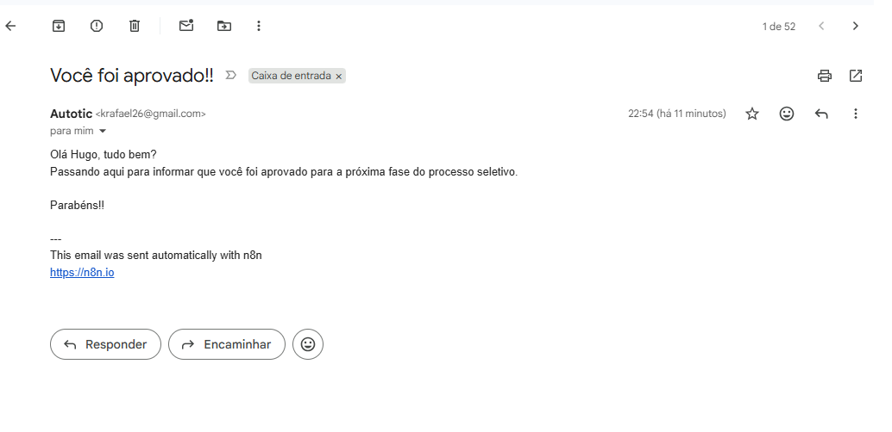

# Automação de Processo Seletivo e Comunicação Dinâmica com n8n


Este projeto apresenta uma automação para otimizar a triagem de candidatos e a comunicação em processos seletivos. Utilizando a ferramenta de orquestração de workflows **n8n**, o fluxo integra planilhas em nuvem ao serviço de disparo de e-mails de forma 100% automatizada, segura e de fácil manutenção.

A solução elimina o trabalho operacional de preenchimento manual de mensagens e malas diretas, garantindo eficiência, personalização e governança na comunicação.

---

## 📊 Arquitetura do Workflow

Abaixo está a representação visual do fluxo estruturado dentro do n8n, mostrando a jornada dos dados desde a captura na planilha até o tratamento de tempo e envio do e-mail:




---

## 🚀 Funcionalidades e Diferenciais Técnicos

*   **Integração com Google Sheets:** Consumo de dados estruturados diretamente da nuvem, permitindo que a automação trabalhe sempre com a versão mais recente dos dados sem necessidade de download de arquivos locais.
*   **Comunicação Dinâmica e Personalizada:** Utilização de expressões e manipulação de objetos JSON no n8n para inserir variáveis (como nome do candidato, status e dados exclusivos) diretamente no escopo do e-mail.
*   **Infraestrutura de Segurança (SMTP dedicado):** Autenticação SMTP utilizando App Passwords e gerenciamento seguro de credenciais pelo n8n.
*   **Gerenciamento de Fila e Proteção Anti-Spam:** Inclusão de um Wait Node de 5 segundos entre os disparos, controlando o ritmo de envio de e-mails e reduzindo o risco de limitação ou bloqueio temporário pelo servidor SMTP.
---

## Fluxo Resumido
```
Schedule Trigger
        │
        ▼
Google Sheets
        │
        ▼
Filtra candidatos
        │
        ▼
Loop (Split in Batches)
        │
        ▼
Envia e-mail personalizado
        │
        ▼
Wait (5 s)
```
---

## 🎯 Objetivo

Automatizar a triagem de candidatos cadastrados em uma planilha do Google Sheets, aplicar critérios de aprovação e enviar e-mails personalizados aos candidatos aprovados, reduzindo atividades manuais e aumentando a eficiência do processo seletivo.

---
## 📚 Aprendizados

Durante este projeto foram praticados conceitos como:

- Criação de workflows no n8n
- Integração com Google Sheets
- Manipulação de dados JSON
- Expressões dinâmicas
- Estruturas condicionais (IF)
- Processamento em lote (Split in Batches)
- Envio de e-mails via SMTP
- Controle de execução com Wait Node

---

## 🔮 Melhorias Futuras

Este projeto poderá ser expandido com novas funcionalidades, como:

- [ ] Envio de e-mails em formato HTML com identidade visual da empresa.
- [ ] Atualização automática da planilha após o envio do e-mail (status: "Enviado").
- [ ] Tratamento de erros e registro de logs de execução.
- [ ] Notificação ao recrutador em caso de falha no envio.
- [ ] Parametrização dos critérios de aprovação por meio de uma aba de configurações no Google Sheets.
- [ ] Integração com modelos de IA para análise automática de currículos.
- [ ] Geração de relatórios com métricas do processo seletivo.
- [ ] Integração com Microsoft Teams ou Slack para envio de notificações.
- [ ] Containerização da solução com Docker para facilitar a implantação.
- [ ] Implantação em ambiente de produção com execução contínua do n8n.


---

## 🛠️ Tecnologias e Ferramentas Utilizadas

*   **n8n** (Orquestrador de Workflows e Integrações API)
*   **n8n Expressions** (Personalização dinâmica de dados)
*   **Google Sheets** (armazenamento estruturado de dados em nuvem)
*   **SMTP / Gmail** (Protocolo de transporte e infraestrutura de e-mail)
*   **JSON** (Estruturação e tráfego de dados entre os nós)
